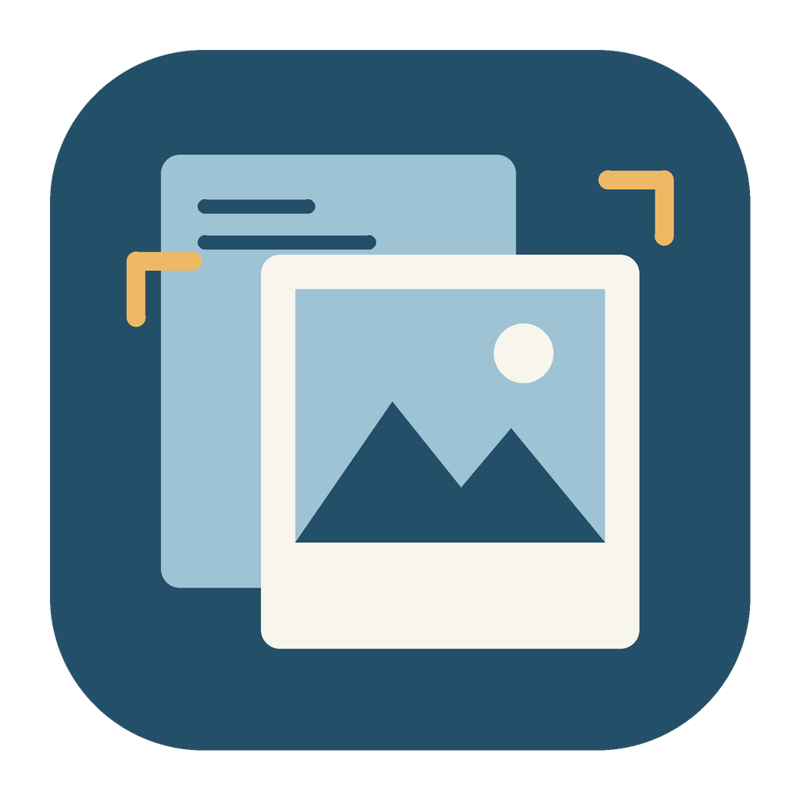
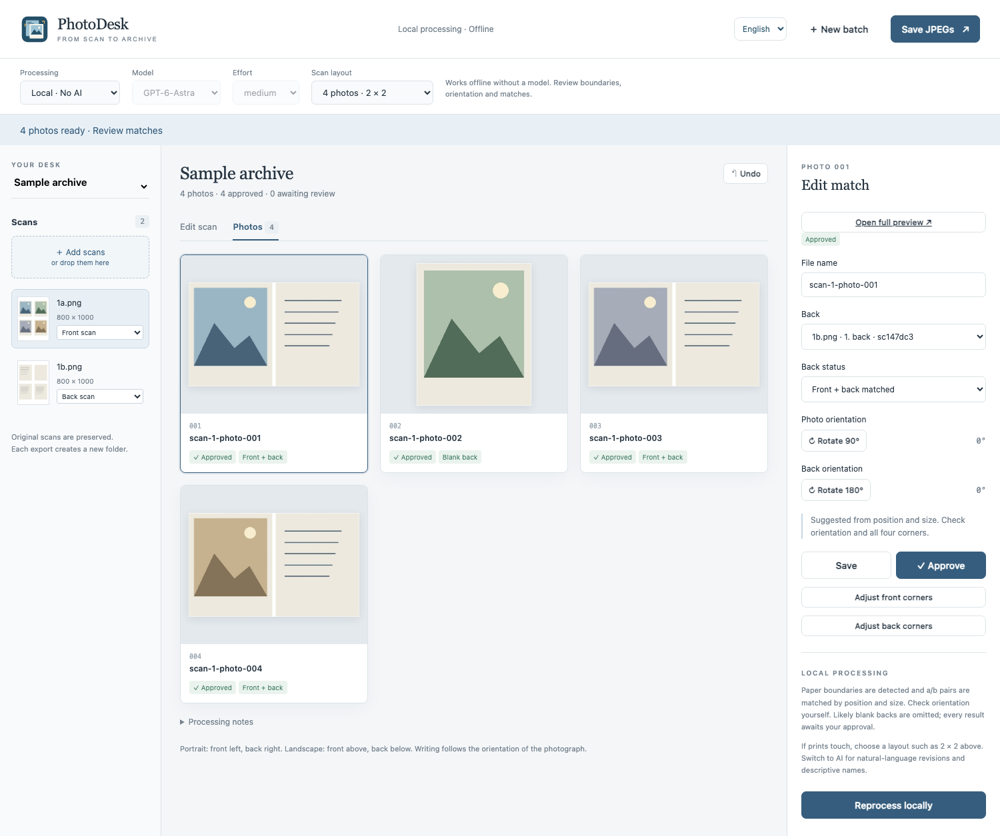

<p align="center"></p>
<h1 align="center">PhotoDesk</h1>
<p align="center">Bir taramada çok fotoğraf. Her fotoğrafın hikâyesi bir arada.</p>
<p align="center"><a href="README.md">English</a> · <strong>Türkçe</strong></p>

PhotoDesk, aynı taramadaki fotoğrafları ayıran, eğik kenarları düzleştiren ve yazılı arkalarını önleriyle birleştiren yerel bir macOS uygulamasıdır. Yapay zekâ kullanmadan başlayabilir; görsel yorumlama ve doğal dille düzeltme için Codex veya OpenRouter seçebilirsin. İngilizce varsayılandır; üst çubuktan Türkçe seçilir ve tercih tarayıcıda korunur.



## Kurulum

macOS ve Python 3.11+ gerekir; 3.12 önerilir. Uygulama kodu bu klasörden çalıştığı için depoyu kalıcı bir yerde tut.

```sh
git clone https://github.com/osmanevski/PhotoDesk.git
cd PhotoDesk
python3 install_macos.py
```

`~/Applications/PhotoDesk.app`, Masaüstü kısayolu ve bağımsız Python ortamı oluşturulur. Uygulamayı açınca tarayıcıda `http://127.0.0.1:8874` açılır; sunucu yalnız yerel bağlantıları kabul eder. Paket imzalı/noter onaylı bağımsız dağıtım değildir. Önceki Fotoğraf Masası kurulumunun çalışma kayıtları ve Anahtar Zinciri kaydı korunur.

## Kullanım

1. **Yeni iş** oluştur ve taramaları topluca sürükle.
2. Ön/arka grupları için `1a.jpeg / 1b.jpeg`, `2a / 2b` adlarını kullan: **a ön**, **b arka**. Çevirirken baskıları aynı yerde tut. Özel adlı dosyalar da yüklenebilir; yerel otomatik eşleştirme sayısal grup ister, diğerlerini elle eşleştir.
3. **Yerel · Yapay zekâsız**, **Yapay zekâ · Codex** veya **API · OpenRouter** seç. Fotoğraflar birbirine değiyorsa 2 × 2 gibi bir yerleşim kullan.
4. Köşeleri, yönleri, eşleşmeleri ve adları kontrol et; gerekli alanları değiştir ve sonuçları onayla. Eksik arka, boş arka kabul edilmez. Tek yüz kaydetmek için uygun arka durumunu seç.
5. **JPEG’leri kaydet** ile yalnız onaylı fotoğrafları yeni klasöre kaydet. Finder'da açabilir veya ZIP indirebilirsin.

Dikey fotoğrafta ön solda, arka sağda; yatay fotoğrafta ön üstte, arka alttadır. Yazı fotoğrafın yönünü izler ve yan kalabilir. Boş arkalar çıktıya eklenmez. Dört köşe düzleştirilir, ortak kenara hizalanır ve 24 piksel ara bırakılır. JPEG kalite 100 / 4:4:4 ve kaynak DPI bilgisi korunur; geometrik işlemler yeniden örnekleme içerir, JPEG kayıpsız değildir. Orijinal dosyalar değişmez.

## İşleme seçenekleri

- **Yerel:** OpenCV/Pillow; model veya ağ çağrısı yapmaz. Konum/boyut eşleştirmesi ve sıralı adlar önerir. Konuyu ve doğru yönü anlayamaz; bütün sonuçlar onay bekler. Soluk yazıyı ve beyaz zemindeki kâğıt kenarlarını kontrol et.
- **Codex:** Ayrı kurulmuş, giriş yapılmış Codex CLI gerekir. Model ve effort yerel katalogdan seçilir; görüntüler seçilen modele gönderilir. Başka modele sessiz geçiş yapılmaz.
- **OpenRouter:** Ayrı API anahtarı, model ve effort seçimi. Anahtar uygulamaya özel macOS Anahtar Zinciri kaydında tutulur. Bağlantı testi fotoğraf göndermez veya model çağırmaz. Analiz ücretlidir; iptal, başlamış uzak işlemin ücretini geri almayabilir.

## Veriler ve sınırlar

Çalışmalar `~/Library/Application Support/FotografMasasi/` içinde tutulur. Varsayılan çıktı `~/Downloads/Fotograf-Masasi/`; kayıt ekranında değiştirilebilir. Eski yollar yükseltmede veri kaybetmemek için korunmuştur. Kaynak hashleri, eşleşmeler ve işleme ayarları `arsiv-kaydi.json` içinde bulunur.

İş başına 100 tarama sayfası / 200 yüz, yükleme isteği başına 512 MB sınırı vardır. Tek analiz aynı anda çalışır. JPEG, PNG, TIFF, PDF, HEIC kabul edilir. Model önizlemeyi görür; çıktı tam çözünürlükten üretilir. Doğrudan yazıcı kontrolü ve klasör izleyicisi yoktur; tamamlanan taramaları sürükleyerek ekle. Sekmeyi kapatmak analizi veya sunucuyu durdurmaz; analiz için **İptal**, sunucu için Activity Monitor kullanılır.

Geliştirme, test ve çeviri dosyalarının ayrıntıları [İngilizce README](README.md#develop-and-test) içinde. Depoda kişisel tarama, API anahtarı veya çalışma kaydı bulunmaz. Testler sentetik görüntüler ve taklit model yanıtları kullanır; gerçek ücretli OpenRouter analizi test kapsamında değildir.
